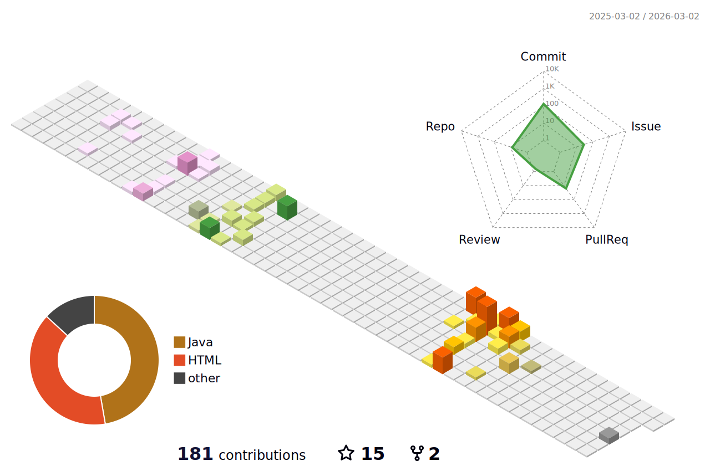

## Salve! Eu sou o Albino
🌐 Estudo Sistemas para Internet no IFSP e sou Técnico em Informática formado pela mesma instituição. 
🐘 Trabalho com desenvolvimento web utilizando como principal linguagem o PHP. 
♨️ Atualmente estou aprendendo C, Java e JavaScript. 
🎨 Sou apaixonado por front-end e design. 

 <!--invisible-->

<!---->

##

<!--
**gabrielalb5/gabrielalb5** is a ✨ _special_ ✨ repository because its `README.md` (this file) appears on your GitHub profile.

Here are some ideas to get you started:

- 🔭 I’m currently working on ...
- 🌱 I’m currently learning ...
- 👯 I’m looking to collaborate on ...
- 🤔 I’m looking for help with ...
- 💬 Ask me about ...
- 📫 How to reach me: ...
- 😄 Pronouns: ...
- ⚡ Fun fact: ...
-->
<!-- 

 -->
